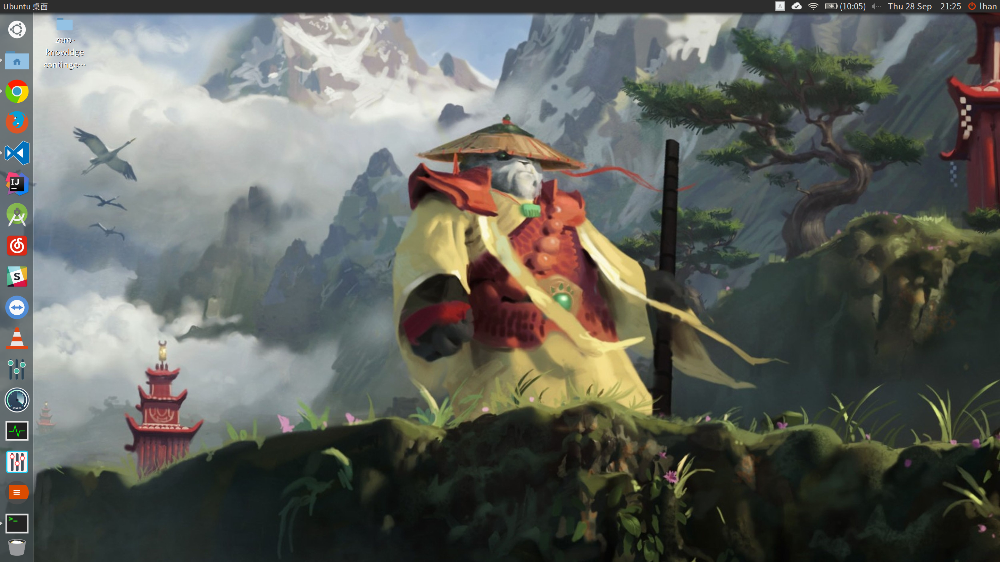
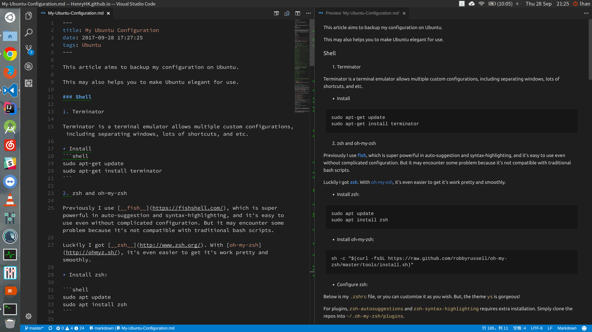

+++
title = "My Ubuntu Configuration"
date = "2017-09-28"
draft = "false"
tags = [
    "Ubuntu",
    "Linux",
    "Configurations",
]
+++

This article aims to backup my configuration on Ubuntu.

This may also helps you to make Ubuntu elegant for use.

### Shell

#### Terminator

Terminator is a terminal emulator allows multiple custom configurations, including separating windows, lots of shortcuts, and etc.

* Install

```shell
sudo apt-get update
sudo apt-get install terminator
```

Another great choice is [Guake](https://github.com/Guake/guake). But you can set Terminator behave the same way as `Guake` by shortcuts.

#### zsh and oh-my-zsh

Previously I use [__fish__](https://fishshell.com/), which is super powerful in auto-suggestion and syntax-highlighting, and it's easy to use even without complicated configuration. But it may encounter some problem because it's not compatible with traditional bash scripts.

Luckily I got [__zsh__](http://www.zsh.org/). With [oh-my-zsh](http://ohmyz.sh/), it's even easier to get it's work pretty and smoothly.

##### Install zsh:

```shell
sudo apt update
sudo apt install zsh
```

##### Install oh-my-zsh:

```shell
sh -c "$(curl -fsSL https://raw.github.com/robbyrussell/oh-my-zsh/master/tools/install.sh)"
```

##### Configure zsh:

Below is my `.zshrc` file, or you can customize it as you wish. But, the theme `ys` is gorgeous!

For plugins, `zsh-autosuggestions` and `zsh-syntax-highlighting` requires extra installation. Simply clone the repos into `~/.oh-my-zsh/plugins`.

You can find my [.zshrc](https://github.com/HenryHK/ubuntu-configs-backup/blob/master/.zshrc.backup) file here.

reopen your shell (or `source .zshrc`)and then it should work.

### Install JDK, Node, and all kinds of environments and softwares

When I'm a newbee of Linux, I install almost everything into 'su' folders, which leads to lots of problems later.

So there should be a bottom line in every Linux user's mind that all applications or activities in Linux should be granted the proper rights.

Because I only want to set up environments for my personal usage, I create two folders under my user directory which is `/home/lhan/environments` and `/home/lhan/softwares`. This is pretty since I never need to do `sudo ./studio.sh` to make my android studio running or do `sudo ./idea.sh` to update my IntelliJ.

For node installation, `nvm` is my only recommendation.

Also, there are some pretty good software on Ubuntu to make it a good OS:

* [网易云音乐 - NetEase CloudMusic](https://music.163.com/#/download)

* [VLC - media player](https://www.videolan.org/) or simply `sudo apt-get install vlc`

* [Stacer - system monitor and cleaner](https://github.com/oguzhaninan/Stacer)

* [Visual Studio Code - the editor that I love most](https://code.visualstudio.com/)

* [Dropbox - ross-platform cloud storage](https://www.dropbox.com/install-linux)

* [tlp - power management for linux](http://linrunner.de/en/tlp/tlp.html)

* [fcitx - input method framework supporting many Chinese input methods](https://fcitx-im.org/wiki/Special:MyLanguage/Fcitx)

* [albert - A spotlight-like software on Linux](https://github.com/albertlauncher/albert) (P.S. if you are using Ubuntu, you may need CompizConfig Settings Manager in order to diable `alt` related hotkeys to use `alt+space` shortcuts for calling albert)

All the above software can be easily installed and requires few configurations.

If you encounter any dependency problems when install `.deb`, try the following commands:

```shell
sudo dpkg -i name_of_package.deb
sudo apt-get install -f
```

This will resolves dependencies problems automatically.

### Themes, Icons, and Fonts

#### Themes & Icons

I use [Flatabulous](https://github.com/anmoljagetia/Flatabulous) theme. This is gorgeous and is perfect in my 15.6' 3k resolution display. As for icons, I use `ultra-flat-icons` as recommended by the author of `Flatabulous`.

#### Fonts

For fonts, as I use Simplified Chinese and English in my daily life, [noto fonts](https://www.google.com/get/noto/) is the best choice. When it comes to programming, I use [Source Code Pro](https://github.com/adobe-fonts/source-code-pro).

---

### Screenshots





