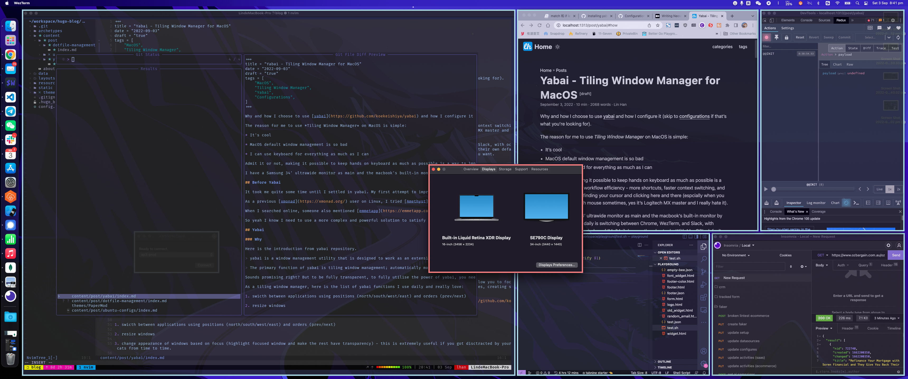

+++
title = "Yabai - Tiling Window Manager for MacOS"
date = "2022-09-03"
draft = "false"
tags = [
    "MacOS",
    "Tiling Window Manager",
    "Yabai",
    "Configurations",
]
+++



Why and how I choose to use [yabai](https://github.com/koekeishiya/yabai) and how I configure it (skip to [configurations](#how) if that's what you're looking for).

The reason for me to use *Tiling Window Manager* on MacOS is simple:

* It's cool

* MacOS default window management is so bad

* I can use keyboard for everything as much as I can

Admit it or not, making it possible to keep hands on keyboard as much as possible is a way to improve your workflow efficiency - more shortcuts, faster context switching, and less time wasted on finding your cursor and clicking here and there (espcially when you have to use bluetooth mouse sometimes, yes it's Logitech MX master and I really hate it).

I have a Samsung 34' ultrawide monitor as main and the macbook's built-in monitor by the side. 99% of my daily is switching between Chrome, WezTerm, and Slack, with occasionally floating window of IMs/Mails/some other dev tools. With MacOS's default window manager, all these apps just overlap and cover each other with their own default window size. Surely I can resize/position them, but it's still annoying when you have a lot opened and what you can do is `cmd-tab` till find what you want.

## Before Yabai

It took me quite some time until I settled in yabai. My first attempt to improve MacOS is [magnet](https://magnet.crowdcafe.com/) - something similar to UX of Windows or some Linux distributions. It served me well until I found my needs exceed what it offered. I need more customisable configurations to resize/reposition/float/maximise windows, switch layouts, switch desktops/spaces.

As a previous [xmonad](https://xmonad.org/) user on Linux, I tried [Amethyst](https://github.com/ianyh/Amethyst) first. The similar keybindings and almost zero-config setup make user experience really good. However it's not good enough - I can't resize windows, no way to switch space via amethyst, and the layouts provided by amethyst is just not good enough. If you don't need the features I mentioned above, Amethyst is actually a solid offer as a tiling window manager on MacOS.

When I searched online, someone also mentioned [emmetapp](https://emmetapp.com/). It seems no better than a normal tiling window manager, actually it looks like an advanced version of magnet. Maybe it's good, but I didn't bother getting a license.

So yeah I know I need to use a more complex and powerful solution to satisfy my needs.

## Yabai

### Why

Here is the introduction from yabai repository.

> yabai is a window management utility that is designed to work as an extension to the built-in window manager of macOS. yabai allows you to control your windows, spaces and displays freely using an intuitive command line interface and optionally set user-defined keyboard shortcuts using [skhd](https://github.com/koekeishiya/skhd) and other third-party software.

> The primary function of yabai is tiling window management; automatically modifying your window layout using a binary space partitioning algorithm to allow you to focus on the content of your windows without distractions. Additional features of yabai include focus-follows-mouse, disabling animations for switching spaces, creating spaces past the limit of 16 spaces, and much more.

Sounds promising right? But to be fully transparent, to fully utilise the power of yabai, you need to disable Mac's [system integrity protection](https://github.com/koekeishiya/yabai/wiki/Disabling-System-Integrity-Protection). If this is something impossible for you, find some other alternatives.

As a tiling window manager, here is the list of yabai functions I use daily and really love (and combining with [skhd](https://github.com/koekeishiya/skhd), yabai is basically all you need for window management on MacOS):

1. swicth between applications using positions (north/south/west/east) and orders (prev/next) (alt + hjkl/alt + tab)

2. resize windows (lctrl + alt + hjkl)

3. change appearance of windows based on focus (highlight focused window and make the rest have transparency) - this is extremely useful if you got disctracted by your cats from time to time. (configured in `~/.yabairc`)

4. throw window to another space (shift + alt + 1/2/3/4)

5. toggle float/maximise a window (occasionally used applications should not occupy our precious screen space, let them buried underneath and only show when they're needed) (alt + t/alt + f)

6. change split way on the fly - switch between vertical or horizontal when you need (alt + e)

7. change layouts on the fly, I use `bsp` and `stack` only. Bsp for multiple/bigger screens, stack for using built-in screen only. If you want a window to be `left-alone`, it can be ignored from tiling as per defined in settings, and it can be per space based. (shift + alt + b/s - bsp/stack respectively, only applied to current focus space, this can be changed in `~/.skhdrc`)

8. switch spaces (alt + 1/2/3/4 for shortcuts or alt + p/n to navigate previous or next)


### How 

1. Install yabai as per [wiki](https://github.com/koekeishiya/yabai/wiki) and install [skhd](https://github.com/koekeishiya/skhd). Important milestones to check your progress are: 1. disable SIP 2. install both via `brew` 3. successfully load yabai scripts.

2. Create a config file under home directory `~/.yabairc` (comments are where my configurations differs from default)

```bash
#!/usr/bin/env sh

# the scripting-addition must be loaded manually if
# you are running yabai on macOS Big Sur. Uncomment
# the following line to have the injection performed
# when the config is executed during startup.
#
# for this to work you must configure sudo such that
# it will be able to run the command without password
#
# see this wiki page for information:
#  - https://github.com/koekeishiya/yabai/wiki/Installing-yabai-(latest-release)
#
sudo yabai --load-sa
yabai -m signal --add event=dock_did_restart action="sudo yabai --load-sa"

# global settings
yabai -m config mouse_follows_focus          off
yabai -m config focus_follows_mouse          off
yabai -m config window_origin_display        default
yabai -m config window_placement             second_child
yabai -m config window_topmost               off
yabai -m config window_shadow                on
yabai -m config window_opacity               on                    ## enable window opacity
yabai -m config window_opacity_duration      0.0
yabai -m config active_window_opacity        1.0
yabai -m config normal_window_opacity        0.9
yabai -m config window_border                on                    ## enable window border
yabai -m config window_border_width          10
yabai -m config active_window_border_color   0xfff08080
yabai -m config normal_window_border_color   0xffadd8e6
yabai -m config insert_feedback_color        0xffd75f5f
yabai -m config split_ratio                  0.50
yabai -m config auto_balance                 off
yabai -m config mouse_modifier               fn
yabai -m config mouse_action1                move
yabai -m config mouse_action2                resize
yabai -m config mouse_drop_action            swap

# general space settings
yabai -m config layout                       bsp
yabai -m config top_padding                  12
yabai -m config bottom_padding               12
yabai -m config left_padding                 12
yabai -m config right_padding                12
yabai -m config window_gap                   06

# ===== Rules ==================================
yabai -m rule --add label="Finder" app="Finder" manage=off
yabai -m rule --add label="Mail" app="Mail" manage=off
yabai -m rule --add label="Calendar" app="Calendar" manage=off
yabai -m rule --add label="Safari" app="^Safari$" title="^(General|(Tab|Password|Website|Extension)s|AutoFill|Se(arch|curity)|Privacy|Advance)$" manage=off
yabai -m rule --add label="macfeh" app="^macfeh$" manage=off
yabai -m rule --add label="System Preferences" app="^System Preferences$" title=".*" manage=off
yabai -m rule --add label="App Store" app="^App Store$" manage=off
yabai -m rule --add label="Activity Monitor" app="^Activity Monitor$" manage=off
yabai -m rule --add label="KeePassXC" app="^KeePassXC$" manage=off
yabai -m rule --add label="Calculator" app="^Calculator$" manage=off
yabai -m rule --add label="Dictionary" app="^Dictionary$" manage=off
yabai -m rule --add label="mpv" app="^mpv$" manage=off
yabai -m rule --add label="Software Update" title="Software Update" manage=off
yabai -m rule --add label="AWS VPN Client" title="AWS VPN Client" manage=off
yabai -m rule --add label="About This Mac" app="System Information" title="About This Mac" manage=off

# ===== Signals ================================
yabai -m signal --add event=application_front_switched action="${ubersicht_spaces_refresh_command}"
yabai -m signal --add event=display_changed action="${ubersicht_spaces_refresh_command}"
yabai -m signal --add event=space_changed action="${ubersicht_spaces_refresh_command}"
yabai -m signal --add event=window_created action="${ubersicht_spaces_refresh_command}"
yabai -m signal --add event=window_focused action="${ubersicht_spaces_refresh_command}"
yabai -m signal --add event=window_title_changed action="${ubersicht_spaces_refresh_command}"
yabai -m signal --add event=mission_control_exit action='echo "refresh" | nc -U /tmp/yabai-indicator.socket'
yabai -m signal --add event=display_added action='echo "refresh" | nc -U /tmp/yabai-indicator.socket'
yabai -m signal --add event=display_removed action='echo "refresh" | nc -U /tmp/yabai-indicator.socket'
yabai -m signal --add event=window_created action='echo "refresh windows" | nc -U /tmp/yabai-indicator.socket'
yabai -m signal --add event=window_destroyed action='echo "refresh windows" | nc -U /tmp/yabai-indicator.socket'
yabai -m signal --add event=window_focused action='echo "refresh windows" | nc -U /tmp/yabai-indicator.socket'
yabai -m signal --add event=window_moved action='echo "refresh windows" | nc -U /tmp/yabai-indicator.socket'
yabai -m signal --add event=window_resized action='echo "refresh windows" | nc -U /tmp/yabai-indicator.socket'
yabai -m signal --add event=window_minimized action='echo "refresh windows" | nc -U /tmp/yabai-indicator.socket'
yabai -m signal --add event=window_deminimized action='echo "refresh windows" | nc -U /tmp/yabai-indicator.socket'
# auto focus to the last window if a window is minimized/closed/destroyed
yabai -m signal --add event=window_destroyed action="yabai -m query --windows --window &> /dev/null || yabai -m window --focus recent || yabai -m window --focus first"
yabai -m signal --add event=application_terminated action="yabai -m query --windows --window &> /dev/null || yabai -m window --focus recent || yabai -m window --focus first"
yabai -m signal --add event=window_minimized active=yes action="yabai -m query --windows --window &> /dev/null || yabai -m window --focus recent || yabai -m window --focus first"
```

3. Create a config file under home directory `~/.skhdrc`. Yabai only provides an interface to manage windows via its excutables. Skhd can be used to bind yabai commands with shortcuts.

```bash
# Restart Yabai
lctrl + shift + alt - r : \
    /usr/bin/env osascript <<< \
        "display notification \"Restarting Yabai\" with title \"Yabai\""; \
    launchctl kickstart -k "gui/${UID}/homebrew.mxcl.yabai"

# Change Layout of current space
shift + alt - s : yabai -m config --space $(yabai -m query --spaces --space | jq -r '.index') layout stack
shift + alt - b : yabai -m config --space $(yabai -m query --spaces --space | jq -r '.index') layout bsp

# Navigate between windows
alt - h : yabai -m window --focus west
alt - j : yabai -m window --focus south
alt - k : yabai -m window --focus north
alt - l : yabai -m window --focus east
alt - tab : if [ "$(yabai -m query --spaces --space | jq -r '.type')" = "stack" ]; then (yabai -m window --focus stack.next || yabai -m window --focus stack.first); else yabai -m window --focus next || yabai -m window --focus first; fi


# Navigate between spaces
alt - 1 : yabai -m space --focus 1
alt - 2 : yabai -m space --focus 2
alt - 3 : yabai -m space --focus 3
alt - 4 : yabai -m space --focus 4

alt - p : yabai -m space --focus prev
alt - n : yabai -m space --focus next

# Moving windows
shift + alt - h : yabai -m window --warp west
shift + alt - j : yabai -m window --warp south
shift + alt - k : yabai -m window --warp north
shift + alt - l : yabai -m window --warp east

# Move focus container to workspace
shift + alt - 1 : yabai -m window --space 1; yabai -m space --focus 1
shift + alt - 2 : yabai -m window --space 2; yabai -m space --focus 2
shift + alt - 3 : yabai -m window --space 3; yabai -m space --focus 3
shift + alt - 4 : yabai -m window --space 4; yabai -m space --focus 4

# Resize windows
lctrl + alt - h : yabai -m window --resize left:-50:0; \
                  yabai -m window --resize right:-50:0
lctrl + alt - j : yabai -m window --resize bottom:0:50; \
                  yabai -m window --resize top:0:50
lctrl + alt - k : yabai -m window --resize top:0:-50; \
                  yabai -m window --resize bottom:0:-50
lctrl + alt - l : yabai -m window --resize right:50:0; \
                  yabai -m window --resize left:50:0
# Equalize size of windows
lctrl + alt - 0 : yabai -m space --balance
# Enable / Disable gaps in current workspace
lctrl + alt - g : yabai -m space --toggle padding; yabai -m space --toggle gap

# Rotate
# Rotate windows clockwise and anticlockwise
alt - r         : yabai -m space --rotate 270
shift + alt - r : yabai -m space --rotate 90
# Rotate on X and Y Axis
shift + alt - x : yabai -m space --mirror x-axis
shift + alt - y : yabai -m space --mirror y-axis

# Set insertion point for focused container
shift + lctrl + alt - h : yabai -m window --insert west
shift + lctrl + alt - j : yabai -m window --insert south
shift + lctrl + alt - k : yabai -m window --insert north
shift + lctrl + alt - l : yabai -m window --insert east

# Float / Unfloat window
shift + alt - space : yabai -m window --toggle float;\
                      yabai -m window --grid 4:4:1:1:2:2
# Same float
alt - t : yabai -m window --toggle float;\
          yabai -m window --grid 4:4:1:1:2:2

# Make window native fullscreen
alt - f         : yabai -m window --toggle zoom-fullscreen
shift + alt - f : yabai -m window --toggle native-fullscreen

# change split way
alt - e : yabai -m window --toggle split
```

This should be all you need to use `yabai`+`skhd` for window management. However, it's still impossible to fully get rid of mouse but it is not what I'm seeking for anyway. As long as I can keep my hands down most of the time - coding in terminal -> search a little in google in browser (I have [vimium](https://www.google.com/search?q=vimium&rlz=1C5CHFA_enAU989AU989&oq=vimium&aqs=chrome..69i57.1398j0j7&sourceid=chrome&ie=UTF-8))-> reply a few messages in slack - it's good enough.

Also a beautiful menubar addon to nicely present and switch spaces if you want some extra info about your layouts/spaces when having a multi-monitor setup - [Yabai Indicator](https://github.com/xiamaz/YabaiIndicator).

Happy hacking :)
